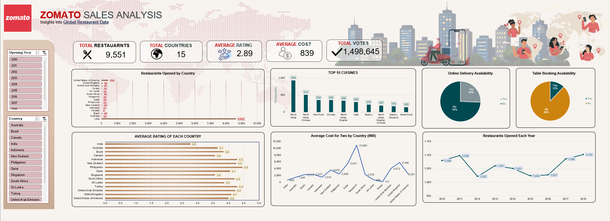

<div align="center">

# Zomato Global Restaurant Analysis

### Excel Analysis | Interactive Dashboard | Stakeholder Deck

[](https://www.microsoft.com/en-us/microsoft-365/excel)
[](https://www.microsoft.com/en-us/microsoft-365/powerpoint)
[](https://github.com/manthan270/Global-Restaurant-Analysis)


</div>

---

## Executive Summary

Analysed **9,551 Zomato restaurant records** across **15 countries** to figure out where Zomato should expand, which services move ratings, and which cuisines win in which markets.

Cleaned the raw data across 3 sheets, built 7 Pivot Tables, and put together a **slicer-driven Excel dashboard** and a PowerPoint deck for stakeholders.

> **Core Objective:** Turn raw restaurant data into clear numbers that help Zomato decide where to expand, what services to push, and which price tier to back.
>
> *Note: India holds 8,652 of the 9,551 records (90.6%) and skews almost every global average. I had to normalise before any cross-country comparison made sense.*


---

## Dashboard Preview



> *The dashboard. Filter by country and year — the KPI cards, charts, and growth timeline update automatically.*

---

## Table of Contents

- [Executive Summary](#executive-summary)
- [Dashboard Preview](#dashboard-preview)
- [Dataset Overview](#dataset-overview)
- [Business Questions Addressed](#business-questions-addressed)
- [Tools and Technical Skills](#tools-and-technical-skills)
- [Key Findings and Strategic Recommendations](#key-findings-and-strategic-recommendations)
- [Repository Structure](#repository-structure)
- [Getting Started](#getting-started)
- [Author](#author)

---

## Dataset Overview

| Attribute | Detail |
|---|---|
| **Total Records** | 9,551 restaurants |
| **Geographic Coverage** | 15 countries |
| **Average Rating** | 2.89 / 5.00 |
| **Average Cost for Two** | ₹839 |
| **Total Customer Votes** | 1,498,645 |
| **Key Variables** | Ratings, Votes, Pricing Tiers, Cuisine Types, Table Booking, Online Delivery, Opening Dates |

---

## Business Questions Addressed

1. Which countries and cities present the highest opportunity for new restaurant expansion?
2. Do value-added services (table booking, online delivery) measurably improve customer ratings?
3. Which cuisine categories consistently outperform across markets?
4. What pricing tier delivers the optimal balance of customer satisfaction and market competition?
5. How does market saturation in India affect average quality perception?

---

## Tools and Technical Skills

| Tool | What Was Done |
|---|---|
|  **Microsoft Excel** | Cleaned 9,551 records across 3 sheets, built 7 Pivot Tables, and designed a slicer-driven dashboard with Country and Year filters. Used COUNTIFS, SUMPRODUCT, and VLOOKUP across 15 countries and 4 price tiers to answer 15 business questions. |
|  **Microsoft Word** | Wrote up the full methodology and answered all 15 business questions in detail — market expansion, service features, cuisine performance, pricing, and India saturation. |
|  **Microsoft PowerPoint** | Built a slide deck walking through the five core business questions, with one chart per question and a recommendation slide at the end. |
|  **GitHub** | Organised the full project — raw data, cleaned workbook, written report, presentation deck, and dashboard screenshot — into a navigable portfolio repo. |

---

## Key Findings and Strategic Recommendations

### 1. Market Expansion — High-Opportunity Geographies

| Market | Average Rating | Restaurants in Dataset | Opportunity Level |
|---|---|---|---|
| **Philippines** | 4.47 | 22 | Very High |
| **Indonesia** | 4.30 | 21 | Very High |
| **Qatar** | 4.06 | 20 | High |
| **Sri Lanka** | 3.87 | 20 | High |
| **Singapore** | 3.58 | 20 | High |
| **Canada** | 3.58 | 4 | High |
| **India** | 2.77 | 8,600+ | Saturated |

**Recommendation:** The Philippines (4.47) and Indonesia (4.30) have the best ratings-to-competition ratio in the dataset. Barely any restaurants on the platform, yet high quality. These two are the strongest candidates for early onboarding pushes.

---

### 2. Service Features — Impact on Customer Satisfaction

| Service Feature | Average Rating (Enabled) | Average Rating (Not Enabled) | Difference |
|---|---|---|---|
| **Table Booking** | 3.48 | 2.81 | +0.67 points |
| **Online Delivery** | 3.29 | 2.75 | +0.53 points |

**Recommendation:** Both features correlate with a clear rating lift — +0.67 for table booking, +0.53 for online delivery. Pushing more restaurant partners to turn these on is one of the cheapest ways to raise average ratings without changing the restaurant mix.

---

### 3. Cuisine Performance — Top-Rated Categories

**Continental** and **Italian** cuisines consistently achieve the highest average customer ratings across all markets in the dataset.

**Recommendation:** When entering a new market, onboard Continental and Italian restaurants first. They set a high quality bar for early users and pull the market average up.

---

### 4. Pricing Strategy — Optimal Price Tier

| Price Range | Average Rating | Competition Level |
|---|---|---|
| Range 1 — Budget | Below average | Very High |
| Range 2 — Mid | Moderate | High |
| **Range 3 — Mid-High** | **3.71** | **Moderate** |
| Range 4 — Premium | Variable | Low |

**Recommendation:** Range 3 hits the sweet spot — highest ratings (3.71) with moderate competition. Partner acquisition and promos should lean here first.

---

### 5. Market Saturation — India

India accounts for **90% of the dataset** (8,600+ restaurants) but averages only **2.77**. More restaurants on the platform hasn't meant better restaurants — markets with fewer listings tend to show higher average ratings.

**Recommendation:** India needs curation, not more listings. A partner certification tier and a quality-filtered discovery mode would give users a reason to trust the platform when the average rating across 8,600 restaurants is 2.77.

---

## Repository Structure

```
zomato-project/
│
├── data/
│   └── Zomato_Restaurant_Analysis.xlsx    # Primary workbook: raw data, cleaned data,
│                                           # Pivot Tables and interactive slicer dashboard
│
├── reports/
│   ├── Zomato_Final_Submission.docx       # Complete written report: methodology,
│   │                                       # formulas used and all business question responses
│   └── Zomato_Restaurant_Analysis.pptx   # Stakeholder presentation slide deck
│
├── dashboard/
│   └── dashboard_preview.png             # Screenshot of the final interactive dashboard
│
├── .gitignore
└── README.md
```

---

## Getting Started

**Prerequisites:** Microsoft Excel 2016 or later is required to interact with slicers and dynamic dashboard elements.

**Step 1 — Clone the repository:**
```bash
git clone https://github.com/manthan270/Global-Restaurant-Analysis.git
cd Global-Restaurant-Analysis
```

**Step 2 — Open the primary workbook:**

Navigate to `data/Zomato_Restaurant_Analysis.xlsx` and open it in Microsoft Excel. Use the **Country** and **Year** slicers to filter the dashboard dynamically across all charts and KPI cards.

**Step 3 — Review supporting documentation:**

The `reports/` folder contains the complete written methodology and the executive presentation deck.

---

## ⚠️ Limitations & Assumptions

Every analysis has boundaries. Here's what this one can't fully account for:

- Data is from 2010–2018 — market conditions, ratings, and competition levels may have changed significantly since then
- India dominates the dataset (90.6%) — this skews several global averages and should be kept in mind when reading overall metrics
- Ratings are user-submitted — they are subject to selection bias; highly engaged users may not represent the average customer
- Costs are in local currencies — no currency conversion was applied, so cost comparisons across countries are not direct
- Low restaurant counts in some countries — markets like Canada (4) and Singapore (20) have very small samples, so their averages should be interpreted with caution

---

## Author

<div align="center">

**Manthan Gadegone**
*Data Analyst*

[](https://github.com/manthan270)
[](mailto:manthangadegone0@gmail.com)
[](https://www.linkedin.com/in/manthan270)

</div>

---

<!--
REPOSITORY SETUP NOTES (not rendered on GitHub)

To clone and explore this project locally:

1. Clone the repository:
   git clone https://github.com/manthan270/Global-Restaurant-Analysis.git
   cd Global-Restaurant-Analysis

2. Open data/Zomato_Restaurant_Analysis.xlsx in Microsoft Excel 2016 or later.
   Use the Country and Year slicers to filter the dashboard dynamically.

3. Review reports/Zomato_Final_Submission.docx for full methodology and findings.

4. Open reports/Zomato_Restaurant_Analysis.pptx for the executive presentation deck.

5. dashboard/dashboard_preview.png contains a static screenshot of the final dashboard.
-->

<!--
MANUAL SETUP STEPS (do these on GitHub.com — cannot be done via README):

1. Go to your repository page on GitHub
2. Click the gear icon next to "About" on the right sidebar
3. Add this description:
   Zomato restaurant data (9,551 records, 15 countries) cleaned and analysed in Excel.
   Dashboard + stakeholder deck included.
4. Add these topic tags:
   excel, data-analysis, dashboard, business-intelligence,
   data-visualization, pivot-tables, zomato
5. Click Save changes
-->
